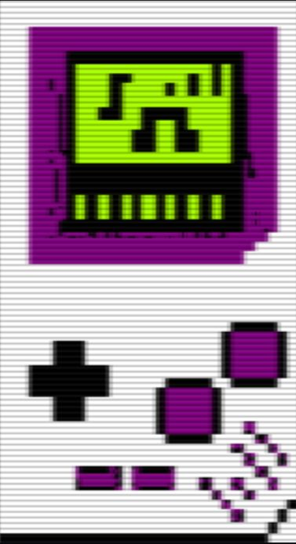

CHIP STUDIO v4 PRO

 · 50 Chips
Tracker chiptune 100% web, inspirado no Game Boy, com 50 emulações de chips clássicos.

Um DAW de bolso que roda no navegador (mobile-first) para compor música 8-bit/16-bit no estilo NES, C64, Game Boy, Mega Drive, Arcade e mais. Sem instalação, sem servidor — só HTML + Web Audio.

Sobre:O Chip Studio v4 é um sequenciador por padrões (pattern-based) com 5 canais simultâneos, mixer, editor de instrumentos com ADSR, wavetable desenhável e exportação direta para WAV. 

Principais recursos:
• Interface Game Boy autêntica: paleta DMG, fonte Press Start 2P, shell com botões físicos 
• Sequenciador de 5 canais · 96 steps por pattern · até 3 patterns (A/B/C) prontos 
• Mixer completo: volume, pan, mute e solo por canal + master limiter 
• Editor de instrumentos: ◦ ADSR completo (Attack, Decay, Sustain, Release) ◦ Duty cycle para pulse ◦ Filtro low-pass com cutoff e ressonância ◦ Wavetable customizável (canvas desenhável de 64 pontos) 
• Sidechain + Delay em um botão (pump estilo EDM chiptune)
 • Piano virtual responsivo ao toque 
• Exportação: ◦ WAV 16-bit estéreo (render offline) ◦ WAV 1-BIT (conversão delta-sigma, som de ZX Spectrum beeper) 
• Demo song incluída: baixo walking, lead NES, bateria completa com ghost notes  50 Chips emulados

O motor de áudio simula o comportamento tonal de:

Nintendo: NES 2A03 Pulse/Triangle/Noise, NES VRC6, VRC7 FM, FDS Wavetable, MMC5, SNES SPC700

Nintendo portátil: GB DMG (Pulse 12.5/25/50/75%, Wavetable, Noise), GBA Direct Sound

Commodore: C64 SID 6581/8580 (Pulse, Saw, Triangle, Noise)

Sega: Master System SN76489, Mega Drive YM2612 + PSG, YM2151, YM2413, YM2203, YM2608, YM3812 OPL2, YMF262 OPL3

Atari: POKEY, TIA, Lynx

Arcade/Otros: AY-3-8910, OKI MSM5205/6295, MultiPCM, Konami SCC/K051649, Namco C140
Cada instrumento carrega o chip como referência tonal — a síntese é feita via Web Audio (osciladores, noise buffer, FM simples e wavetable).

## Como usar:
1. Abra o index.html no navegador (funciona offline)
 2. Toque em PLAY — o áudio inicia após a primeira interação
 3. PATTERN: clique nas células para inserir notas (C-4, E-4, etc) 4. INSTR: escolha chip, wave, ADSR e desenhe sua wavetable 
5. MIX: ajuste volumes — use SOLO para isolar 
6. BPM: 60–200 
7. Exporte com os botões WAV ou 1-BIT  Atalhos mobile 
• Toque longo na célula = apaga 
• Arrastar no piano = glissando • Botão FX = ativa sidechain + delay sincronizado  Tecnologias 
• Vanilla JavaScript (sem frameworks) 
• Web Audio API + OfflineAudioContext para render 
• Canvas 2D para wavetable • CSS pixel-perfect com variáveis Game Boy 
• Playables SDK integrado: ◦ game_ready (detecção por rAF) ◦ 
user_interaction_start ◦ game_ended e error (auto-capture)

 Estrutura do arquivo:
É um single-file app (∼1450 linhas)
. Tudo está no HTML:
• <script> Playables SDK (linhas 5-193) 
• Touch patch para passive listeners (194-213) 
• CSS Game Boy (218-340) 
• Engine de áudio, sequenciador e UI (500-1448)  Roadmap sugerido 
• [ ] Salvar/carregar .json 
• [ ] Importação de MIDI 
• [ ] Mais padrões (até 16) 
• [ ] Efeitos por canal (arpeggio, vibrato, slide) 
• [ ] Modo tracker vertical clássico  Licença
